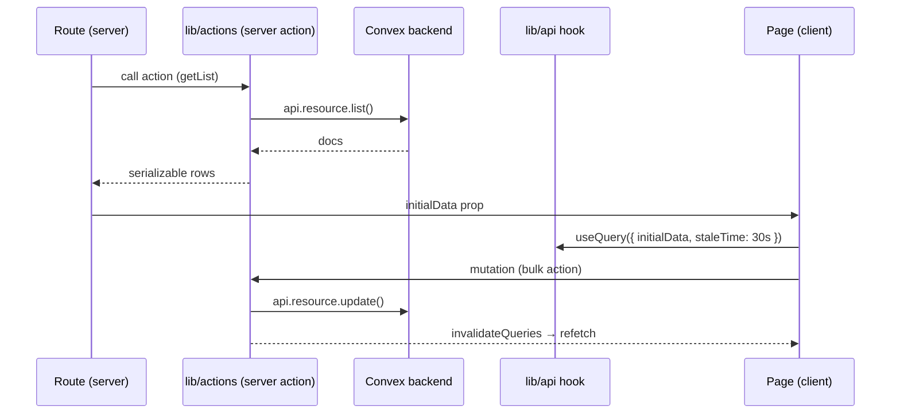
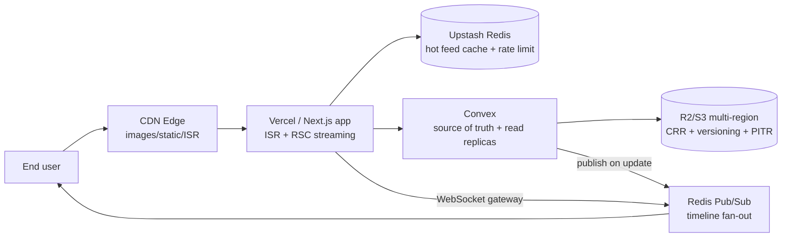

# Architecture — EventNu Monorepo

How the three workspaces fit together and where the code lives. Companion docs:
`docs/CONVENTIONS.md` (conventions), `docs/decisions/` (ADRs), `REFACTORING.md`
(roadmap), `AUDIT.md` (technical/security audit).

## Workspace topology

```mermaid
flowchart LR
  W[web app<br/>Next.js 16 consumer site] --> C[packages/convex<br/>@eventnu/convex]
  A[admin-app<br/>Next.js 16 admin dashboard] --> C
  C --> D[Convex cloud<br/>shared deployment]
  A -->|server actions| C
  W -->|convex/react hooks| C
  A -->|TanStack Query, seeded with server initialData| A
```

One Convex backend (`packages/convex/`, workspace `@eventnu/convex`) is consumed by
both apps (ADR-0002). Admin-app has **no Convex deployment of its own** — it imports
`@eventnu/convex/_generated/*` and type-checks against it in CI without a Convex
server (the generated files are git-tracked).

| Path | Package | Role |
|---|---|---|
| `admin-app/` | `admin-app` | Admin dashboard (internal content team): posting, moderation, CMS, analytics |
| `web/` | `web` | Consumer site: the Addis city guide |
| `packages/convex/` | `@eventnu/convex` | Shared Convex backend (schema, queries, mutations, actions, HTTP) |

## Coupling rules

- **Admin → Convex**: server actions in `admin-app/src/lib/actions/*` call
  `api.*` / `internal.*`; generated types come from `@eventnu/convex/_generated/*`.
  No `convex/react` `useQuery` in admin-app (auth-only exception:
  `@convex-dev/auth/react`).
- **Web → Convex**: `convex/react` hooks (`useQuery`, `useMutation`) plus
  `@convex-dev/auth/react`; server-side API modules are guarded with `server-only`.
- **Codegen**: run `npm -w @eventnu/convex run codegen` after schema/function changes
  and commit the `_generated/**` diff. Both apps type-check against the same tracked
  output, so codegen drift breaks CI (`typegen` job fails on `git diff --exit-code`).
- **Secrets**: only the `packages/convex/.env.local` deployment env is Convex-specific;
  both apps get their public Convex URLs via `NEXT_PUBLIC_CONVEX_URL` /
  `NEXT_PUBLIC_CONVEX_SITE_URL` (see `admin-app/README.md`).

## Admin-app module map

```
admin-app/src/
├── app/                      Next.js App Router routes (server components)
│   ├── (app)/                Authenticated area
│   │   ├── events/           list / new / [id]            ← posting flow
│   │   ├── categories/       hierarchy management
│   │   ├── cms/              pages, announcements, contact submissions
│   │   ├── hosts/ · organizers/ · users/ · reports/
│   │   ├── notifications/ · support/ · analytics/ · settings/
│   └── auth/                 sign-in, callback, password pages
├── components/               React components
│   ├── ui/                   THE design-system primitive layer (buttons, dialogs, inputs)
│   ├── shared/               genuinely shared pieces (skeletons, StatCard)
│   ├── layout/               shell, sidebar, nav, PageLayout
│   ├── list/                 DataTable, FilterBar, StatusBadge, Pagination, ConfirmDialog
│   ├── events/ · categories/ · cms/ · hosts/ · users/ · organizers/ ·
│   │   reports/ · notifications/ · support/ · analytics/ · settings/
│   └── providers/            TanStack Query, theme, Convex auth client
├── lib/
│   ├── actions/              server actions → Convex (mutations + list reads)
│   ├── api/                  TanStack Query hooks per resource (list-page client layer)
│   ├── auth.ts               session / auth helpers
│   ├── errors.ts             getErrorMessage — the single error-handling path
│   ├── format.ts             date/time formatting (one source of truth)
│   ├── mappers.ts            Convex Doc → UI row/option mappers
│   ├── pagination.ts         client-side pagination helpers
│   ├── motion.ts             shared framer-motion presets (fadeUp)
│   └── utils.ts              cn(), formatFileSize(), compressImage()
├── store/                    (reserved)
└── proxy.ts                  (reserved)
```

### Data flow on a list page



Reads flow server → TanStack Query (seeded with `initialData`); mutations call server
actions, then `invalidateQueries` + `revalidatePath` (kept for the SSR seed).

## Web-app module map

```
web/
├── app/                      Next.js App Router routes (server components)
│   ├── events/[slug]/        event detail page (force-static, revalidate 300)
│   ├── discover/             discover page
│   ├── schedule/             itinerary/schedule page
│   ├── categories/ · organizer/ · organizers/ · experiences/ · profile/ · saved/ · stories/ · auth/ · info/ · about/ · contact/
│   └── api/                  route handlers (csp-report)
├── components/
│   ├── ui/                   THE design-system primitive layer (buttons, inputs, dialogs)
│   ├── layout/               TopNav, Footer, BottomTabBar, Container, MainContent, AnnouncementBanner
│   ├── events/               event detail + list components
│   │   ├── detail/           EventHero, EventDetails, EventGallery, EventInfoCard, ReservationForm, SimilarEvents, …
│   │   └── cards/            EventCard, EventList, OrganizerCard
│   ├── home/                 homepage sections (FeaturedCarousel, FeaturedMarquee, SearchBar, CategoryEventShelf, …)
│   ├── discover/             DiscoverPageClient
│   ├── organizer-dashboard/  signed-in organizer's dashboard (NOT the public organizers/ landing)
│   ├── organizers/           public organizer landing sections (HeroSection, Testimonials, FAQSection, …)
│   ├── auth/ · contact/ · moderation/ · profile/ · saved/ · stories/ · schedule/ · social/ · verification/ · experiences/ · pwa/ · effects/ · providers/
├── lib/
│   ├── actions/              server actions (contact form)
│   ├── api/                  server-side data modules (events, organizers, public-client, map-event) — `server-only`
│   ├── hooks/                useScrollReveal, usePrefersReducedMotion
│   └── (top-level pure modules)  auth, dates, calendar, sanitize, media, site, utils, logger, …
└── types/                    shared UI types (Event, Category, Page, …)
```

## Convex module map (`packages/convex/convex`)

| Module | Contents |
|---|---|
| `schema.ts` | Tables, compound indexes (`by_<field1>_and_<field2>`) |
| `helpers.ts` / `constants.ts` | Shared primitives: `patchDefined`, slugify, `requireAdmin`, moderation-log/notification inserts, image batch insert |
| `events/` | `read` · `write` · `moderation` · `enrichment` (split from one 592-line file) |
| `cms/` | `pages` · `announcements` · `contact` |
| `auth.ts` / `auth.config.ts` | Convex Auth (Google OAuth + password) |
| `http.ts` | HTTP endpoints / webhooks (validates `req.json()` as `unknown`) |
| `admin.ts`, `adminSettings.ts`, `dashboard.ts`, `analytics.ts` | Admin surface + stats |
| `categories.ts`, `hosts.ts`, `organizers.ts`, `profiles.ts`, `features.ts` | Content catalogs |
| `reports.ts`, `moderation.ts`, `notifications.ts`, `support.ts` | Trust & safety |
| `likes.ts`, `comments.ts`, `bookmarks.ts`, `follows.ts`, `shares.ts`, `reservations.ts`, `experiencePosts.ts`, `stories.ts`, `email.ts` | Consumer-site features |
| `crons.ts`, `rateLimiter.ts`, `migrations.ts`, `seed.ts` | Ops |

## Routes & responsibilities

- Consumer routes are **stable** (`/events`, `/events/[slug]`, `/categories/[slug]`,
  `/info/[slug]`, …) — no link breakage allowed. Added in the 2026-08 feature work:
  `/saved` (bookmarks, formerly a `/profile?tab=bookmarks` alias), `/stories` (community
  stories feed), and `/profile/settings` (profile/security/privacy/post management).
- Admin routes live under `(app)/`; the role gate resolves in the layout, profile and
  nav counts are server-seeded.
- Admin search inputs debounce ~400ms; TanStack Query `staleTime` is consistent
  (30s) across list pages.

## Target architecture (scaled to 1M concurrent users)

Planned target state; see `tasks/plan.md` for the phased delivery and
`docs/decisions/ADR-0005-scale-architecture.md` for the decision. Convex stays the source
of truth; caching, CDN, durability, and realtime fan-out are pushed to the edge.



Key additions over the current topology:

| Component | Role |
|---|---|
| `publicEventCards` (Convex table) | Materialized read model; kills the N+1 fan-out in `events/enrichment.ts` |
| CDN + ISR + Redis cache | Serve public feeds/static; cache-misses only hit Convex; writes bypass cache |
| WebSocket gateway + Redis Pub/Sub | Per-user timeline fan-out at 1M connections; reconnect backfill |
| `eventFeed` (Convex table) | Append-only per-user log for durable delivery + backfill |
| R2/S3 multi-region CRR + PITR | Zero data loss for photos/profile data; proven by restore drill |
| `useOptimisticToggle` (web) | Optimistic like/save/follow (no spinner); reservation keeps explicit pending state |
